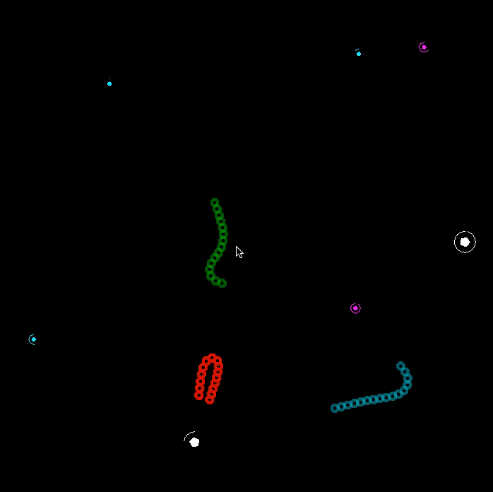

# Игра «Змейки»

Эта игра была создана в демонстрационных целях для доклада «Простые MMO игры на Haskell».



## Сборка

Чтобы собрать этот проект вам понадобится [Stack](https://docs.haskellstack.org/en/stable/README/#how-to-install).

Перед первой сборкой необходимо установить подготовить всё необходимое (скачать компилятор например).
Всё это сделает за вас Stack, при помощи команды

```
stack setup
```

После этого можно собрать проект вместе со всеми необходимыми зависимостями:

```
stack build
```

## Запуск

В проекте представлено 3 исполняемых файла:
- `snakes` — одиночная игра (локальная);
- `snakes-server` — сервер для многопользовательской игры;
- `snakes-client` — клиент для многопользовательской игры.

### Одиночная игра

Одиночная игра (против ботов) запускается простой командой из директории проекта:

```
stack exec snakes
```

### Многопользовательская игра

Для начала должен быть поднят игровой сервер:

```
stack exec snakes-server
```

Затем каждый клиент может быть запущен командой:

```
stack exec snakes-client
```

Клиент автоматически подключается к серверу и присоединяется к игре!

## OpenGL

На некоторых системах необходимо дополнительно установить библиотеки OpenGL с заголовочными файлами.
Если этого не сделать, то вы можете увидеть следующую ошибку:

```
Configuring OpenGLRaw-3.2.0.0...
setup-Simple-Cabal-1.24.0.0-ghc-8.0.1: Missing dependency on a foreign
library:
* Missing C library: GL
```

#### Ubuntu

```
sudo apt-get update
sudo apt-get install freeglut3 freeglut3-dev
```

